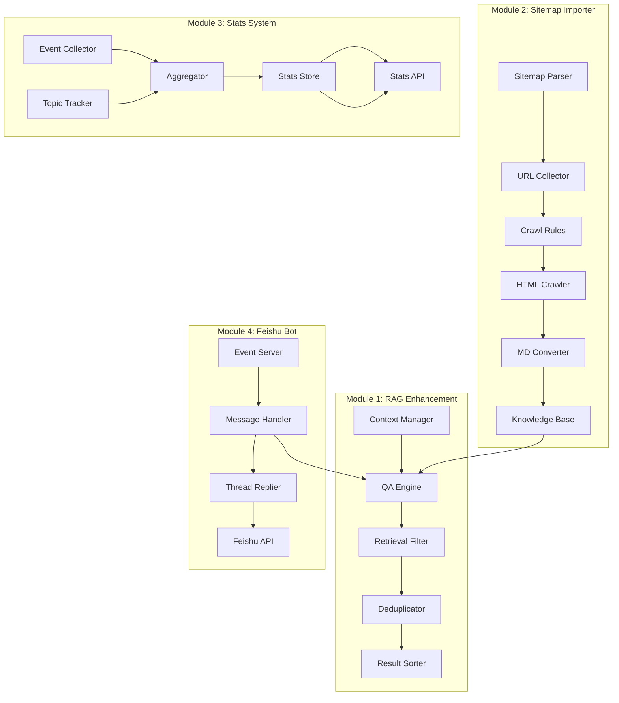

# Design Document: PandaWiki Enhancements

## Overview

本设计文档描述了 pandawiki-enhancements 四个功能模块的技术实现方案。这些增强功能将在现有的 Python 每日文章聚合器基础上构建，复用现有的 QA 引擎、ChromaDB 向量存储和飞书机器人基础设施。

### 设计目标

1. **模块化**: 每个功能模块独立实现，可单独启用/禁用
2. **向后兼容**: 不破坏现有功能，新配置项使用合理默认值
3. **可测试性**: 核心逻辑与 I/O 分离，支持单元测试和属性测试
4. **性能**: 使用缓存和异步处理优化响应时间

## Architecture



## Components and Interfaces

### Module 1: RAG 检索优化

#### 1.1 RetrievalConfig 配置类

```python
@dataclass
class RetrievalConfig:
    """RAG 检索配置"""
    similarity_threshold: float = 0.5  # 相似度阈值 [0, 1]
    max_chunks_per_doc: int = 3        # 每文档最大分块数，0 表示无限制
    max_history_turns: int = 5         # 最大历史对话轮数
    dedup_threshold: float = 0.95      # 去重相似度阈值
    
    def validate(self) -> None:
        """验证配置参数"""
        if not 0 <= self.similarity_threshold <= 1:
            raise ValueError(f"similarity_threshold must be in [0, 1], got {self.similarity_threshold}")
        if self.max_chunks_per_doc < 0:
            raise ValueError(f"max_chunks_per_doc must be >= 0, got {self.max_chunks_per_doc}")
```

#### 1.2 EnhancedRetriever 增强检索器

```python
class EnhancedRetriever:
    """增强的 RAG 检索器"""
    
    def __init__(self, knowledge_base: KnowledgeBase, config: RetrievalConfig):
        self.kb = knowledge_base
        self.config = config
    
    def retrieve(
        self,
        query: str,
        history: list[ConversationTurn] | None = None,
        n_results: int = 10
    ) -> RetrievalResult:
        """
        执行增强检索
        
        Args:
            query: 用户查询
            history: 对话历史（可选）
            n_results: 期望返回结果数
            
        Returns:
            RetrievalResult 包含过滤、去重、排序后的结果
        """
        pass
    
    def _filter_by_threshold(self, results: list[ChunkResult]) -> list[ChunkResult]:
        """按相似度阈值过滤"""
        pass
    
    def _limit_per_document(self, results: list[ChunkResult]) -> list[ChunkResult]:
        """限制每文档分块数"""
        pass
    
    def _deduplicate(self, results: list[ChunkResult]) -> list[ChunkResult]:
        """去重相似内容"""
        pass
    
    def _sort_results(self, results: list[ChunkResult]) -> list[ChunkResult]:
        """排序结果"""
        pass
```

#### 1.3 HistoryAwareQueryBuilder 历史感知查询构建器

```python
class HistoryAwareQueryBuilder:
    """基于对话历史构建增强查询"""
    
    def build_query(
        self,
        current_query: str,
        history: list[ConversationTurn],
        max_turns: int = 5
    ) -> str:
        """
        构建包含历史上下文的查询
        
        Args:
            current_query: 当前用户查询
            history: 对话历史
            max_turns: 使用的最大历史轮数
            
        Returns:
            增强后的查询字符串
        """
        pass
```

### Module 2: Sitemap 导入器

#### 2.1 SitemapParser 解析器

```python
@dataclass
class SitemapEntry:
    """Sitemap 条目"""
    loc: str                          # 页面 URL
    lastmod: datetime | None = None   # 最后修改时间
    changefreq: str | None = None     # 更新频率
    priority: float | None = None     # 优先级

class SitemapParser:
    """Sitemap XML 解析器"""
    
    def parse(self, url: str) -> list[SitemapEntry]:
        """
        解析 sitemap.xml
        
        Args:
            url: sitemap.xml 的 URL
            
        Returns:
            SitemapEntry 列表
            
        Raises:
            SitemapParseError: 解析失败
        """
        pass
    
    def parse_index(self, url: str) -> list[str]:
        """解析 sitemap index，返回子 sitemap URL 列表"""
        pass
    
    def _decompress_if_needed(self, content: bytes) -> str:
        """处理 gzip 压缩"""
        pass
```

#### 2.2 CrawlRuleEngine 抓取规则引擎

```python
@dataclass
class CrawlRules:
    """抓取规则配置"""
    include_patterns: list[str] = field(default_factory=list)  # 包含模式
    exclude_patterns: list[str] = field(default_factory=list)  # 排除模式
    use_regex: bool = False  # 是否使用正则表达式

class CrawlRuleEngine:
    """抓取规则引擎"""
    
    def __init__(self, rules: CrawlRules):
        self.rules = rules
        self._compile_patterns()
    
    def should_crawl(self, url: str) -> bool:
        """
        判断 URL 是否应该抓取
        
        Args:
            url: 待检查的 URL
            
        Returns:
            True 如果应该抓取，False 否则
        """
        pass
    
    def _compile_patterns(self) -> None:
        """编译模式为正则表达式"""
        pass
```

#### 2.3 IncrementalCrawler 增量爬虫

```python
@dataclass
class CrawlState:
    """爬取状态"""
    url: str
    last_crawl: datetime | None
    content_hash: str | None

@dataclass
class CrawlStats:
    """爬取统计"""
    new_pages: int = 0
    updated_pages: int = 0
    skipped_pages: int = 0
    failed_pages: int = 0

class IncrementalCrawler:
    """增量爬虫"""
    
    def __init__(self, state_store: CrawlStateStore):
        self.state_store = state_store
    
    def crawl(
        self,
        entries: list[SitemapEntry],
        force_refresh: bool = False
    ) -> tuple[list[CrawledPage], CrawlStats]:
        """
        执行增量爬取
        
        Args:
            entries: Sitemap 条目列表
            force_refresh: 是否强制刷新所有页面
            
        Returns:
            (爬取的页面列表, 统计信息)
        """
        pass
    
    def _should_crawl(self, entry: SitemapEntry, state: CrawlState | None) -> bool:
        """判断是否需要爬取"""
        pass
```

#### 2.4 HTMLToMarkdownConverter 转换器

```python
class HTMLToMarkdownConverter:
    """HTML 转 Markdown 转换器"""
    
    def __init__(self, remove_tags: list[str] | None = None):
        self.remove_tags = remove_tags or ['script', 'style', 'nav', 'footer', 'header']
    
    def convert(self, html: str) -> str:
        """
        将 HTML 转换为 Markdown
        
        Args:
            html: HTML 内容
            
        Returns:
            Markdown 格式的文本
        """
        pass
    
    def _clean_html(self, html: str) -> str:
        """清理 HTML，移除不需要的标签"""
        pass
    
    def _preserve_structure(self, soup: BeautifulSoup) -> str:
        """保留文档结构转换"""
        pass
```

### Module 3: 统计分析系统

#### 3.1 数据模型

```python
@dataclass
class PageViewEvent:
    """页面浏览事件"""
    article_id: str
    timestamp: datetime
    user_id: str | None = None
    session_id: str | None = None
    referer: str | None = None

@dataclass
class QAEvent:
    """问答事件"""
    query: str
    answer: str
    timestamp: datetime
    response_time_ms: int
    confidence_score: float
    user_id: str | None = None
    chat_id: str | None = None
    sources: list[str] = field(default_factory=list)

@dataclass
class SourceQuality:
    """来源质量指标"""
    source_id: str
    source_name: str
    total_fetches: int
    successful_fetches: int
    avg_content_length: float
    avg_quality_score: float
    
    @property
    def response_rate(self) -> float:
        return self.successful_fetches / max(self.total_fetches, 1)
    
    @property
    def reliability_score(self) -> float:
        return self.response_rate * 0.6 + self.avg_quality_score * 0.4
```

#### 3.2 StatsCollector 统计收集器

```python
class StatsCollector:
    """统计数据收集器"""
    
    def __init__(self, store: StatsStore):
        self.store = store
        self._view_dedup_window = timedelta(minutes=5)
    
    def record_page_view(self, event: PageViewEvent) -> None:
        """记录页面浏览"""
        pass
    
    def record_qa_event(self, event: QAEvent) -> None:
        """记录问答事件"""
        pass
    
    def record_source_fetch(
        self,
        source_id: str,
        success: bool,
        content_length: int = 0,
        quality_score: float = 0.0
    ) -> None:
        """记录来源抓取"""
        pass
    
    def _is_duplicate_view(self, event: PageViewEvent) -> bool:
        """检查是否重复浏览"""
        pass
```

#### 3.3 StatsAggregator 统计聚合器

```python
class StatsAggregator:
    """统计数据聚合器"""
    
    def __init__(self, store: StatsStore):
        self.store = store
    
    def get_hot_articles(
        self,
        time_range: TimeRange,
        limit: int = 10
    ) -> list[ArticleStats]:
        """获取热门文章"""
        pass
    
    def get_qa_stats(
        self,
        time_range: TimeRange,
        user_id: str | None = None
    ) -> QAStats:
        """获取问答统计"""
        pass
    
    def get_source_ranking(self, limit: int = 20) -> list[SourceQuality]:
        """获取来源排名"""
        pass
    
    def get_trending_topics(
        self,
        time_range: TimeRange,
        limit: int = 10
    ) -> list[TrendingTopic]:
        """获取热门话题"""
        pass
```

#### 3.4 TopicTracker 话题追踪器

```python
class TopicTracker:
    """话题追踪器"""
    
    def __init__(self, keyword_extractor: KeywordExtractor):
        self.extractor = keyword_extractor
    
    def extract_topics(self, query: str) -> list[str]:
        """从查询中提取话题关键词"""
        pass
    
    def detect_spike(
        self,
        topic: str,
        current_count: int,
        baseline_count: float
    ) -> bool:
        """检测话题突增"""
        pass
    
    def get_trend_direction(
        self,
        topic: str,
        current_period: TimeRange,
        previous_period: TimeRange
    ) -> TrendDirection:
        """获取趋势方向"""
        pass
```

### Module 4: 飞书双向机器人

#### 4.1 FeishuEventHandler 事件处理器

```python
@dataclass
class FeishuMessage:
    """飞书消息"""
    message_id: str
    chat_id: str
    sender_id: str
    content: str
    mentions: list[str]
    root_id: str | None = None  # 线程根消息 ID
    parent_id: str | None = None  # 父消息 ID

class FeishuEventHandler:
    """飞书事件处理器"""
    
    def __init__(
        self,
        qa_engine: QAEngine,
        bot_id: str,
        always_respond: bool = False
    ):
        self.qa_engine = qa_engine
        self.bot_id = bot_id
        self.always_respond = always_respond
        self._processed_events: set[str] = set()
    
    def handle_message(self, event: dict) -> FeishuResponse | None:
        """
        处理消息事件
        
        Args:
            event: 飞书事件数据
            
        Returns:
            响应消息，如果不需要响应则返回 None
        """
        pass
    
    def _should_respond(self, message: FeishuMessage) -> bool:
        """判断是否应该响应"""
        pass
    
    def _extract_question(self, message: FeishuMessage) -> str:
        """提取问题文本，移除 @mention"""
        pass
    
    def _is_duplicate_event(self, event_id: str) -> bool:
        """检查是否重复事件"""
        pass
```

#### 4.2 ThreadReplier 线程回复器

```python
class ThreadReplier:
    """线程回复器"""
    
    def __init__(self, feishu_client: FeishuClient, thread_enabled: bool = True):
        self.client = feishu_client
        self.thread_enabled = thread_enabled
    
    def reply(
        self,
        chat_id: str,
        message_id: str,
        content: str,
        sources: list[dict] | None = None
    ) -> bool:
        """
        发送回复
        
        Args:
            chat_id: 群聊 ID
            message_id: 原消息 ID（用于线程）
            content: 回复内容
            sources: 来源链接列表
            
        Returns:
            是否发送成功
        """
        pass
    
    def _build_reply_content(
        self,
        answer: str,
        sources: list[dict] | None
    ) -> dict:
        """构建回复内容"""
        pass
```

#### 4.3 EnhancedEventServer 增强事件服务器

```python
class EnhancedEventServer:
    """增强的飞书事件服务器"""
    
    def __init__(
        self,
        host: str,
        port: int,
        verification_token: str,
        encrypt_key: str | None = None
    ):
        self.host = host
        self.port = port
        self.verification_token = verification_token
        self.encrypt_key = encrypt_key
        self._event_handler: FeishuEventHandler | None = None
    
    def set_handler(self, handler: FeishuEventHandler) -> None:
        """设置事件处理器"""
        self._event_handler = handler
    
    async def handle_request(self, request: Request) -> Response:
        """处理 HTTP 请求"""
        pass
    
    def _verify_signature(self, request: Request) -> bool:
        """验证请求签名"""
        pass
    
    def _handle_challenge(self, data: dict) -> dict:
        """处理 URL 验证挑战"""
        pass
    
    async def _process_event_async(self, event: dict) -> None:
        """异步处理事件"""
        pass
```

## Data Models

### 配置文件扩展 (config.yaml)

```yaml
# RAG 增强配置
rag_enhancement:
  enabled: true
  similarity_threshold: 0.5
  max_chunks_per_doc: 3
  max_history_turns: 5
  dedup_threshold: 0.95

# Sitemap 导入器配置
sitemap_importer:
  enabled: true
  state_file: "data/sitemap_state.json"
  crawl_rules:
    include_patterns:
      - "/docs/*"
      - "/blog/*"
    exclude_patterns:
      - "*/archive/*"
      - "*/tag/*"
    use_regex: false
  html_converter:
    remove_tags:
      - script
      - style
      - nav
      - footer

# 统计系统配置
stats_system:
  enabled: true
  database_path: "data/stats.db"
  view_dedup_window_minutes: 5
  cache_ttl_seconds: 300
  source_reliability_threshold: 0.7

# 飞书双向机器人配置
feishu_interactive:
  enabled: true
  always_respond: false
  thread_replies: true
  event_server:
    host: "0.0.0.0"
    port: 8080
```

### 数据库 Schema (SQLite)

```sql
-- 页面浏览统计
CREATE TABLE page_views (
    id INTEGER PRIMARY KEY AUTOINCREMENT,
    article_id TEXT NOT NULL,
    user_id TEXT,
    session_id TEXT,
    referer TEXT,
    timestamp DATETIME NOT NULL,
    created_at DATETIME DEFAULT CURRENT_TIMESTAMP
);

CREATE INDEX idx_page_views_article ON page_views(article_id);
CREATE INDEX idx_page_views_timestamp ON page_views(timestamp);

-- 问答事件
CREATE TABLE qa_events (
    id INTEGER PRIMARY KEY AUTOINCREMENT,
    query TEXT NOT NULL,
    answer TEXT NOT NULL,
    response_time_ms INTEGER NOT NULL,
    confidence_score REAL NOT NULL,
    user_id TEXT,
    chat_id TEXT,
    sources TEXT,  -- JSON array
    timestamp DATETIME NOT NULL,
    created_at DATETIME DEFAULT CURRENT_TIMESTAMP
);

CREATE INDEX idx_qa_events_timestamp ON qa_events(timestamp);
CREATE INDEX idx_qa_events_user ON qa_events(user_id);

-- 来源质量
CREATE TABLE source_quality (
    source_id TEXT PRIMARY KEY,
    source_name TEXT NOT NULL,
    total_fetches INTEGER DEFAULT 0,
    successful_fetches INTEGER DEFAULT 0,
    total_content_length INTEGER DEFAULT 0,
    total_quality_score REAL DEFAULT 0,
    updated_at DATETIME DEFAULT CURRENT_TIMESTAMP
);

-- 话题统计
CREATE TABLE topic_stats (
    id INTEGER PRIMARY KEY AUTOINCREMENT,
    topic TEXT NOT NULL,
    count INTEGER DEFAULT 1,
    period_start DATETIME NOT NULL,
    period_end DATETIME NOT NULL,
    created_at DATETIME DEFAULT CURRENT_TIMESTAMP
);

CREATE INDEX idx_topic_stats_topic ON topic_stats(topic);
CREATE INDEX idx_topic_stats_period ON topic_stats(period_start, period_end);

-- Sitemap 爬取状态
CREATE TABLE crawl_state (
    url TEXT PRIMARY KEY,
    last_crawl DATETIME,
    content_hash TEXT,
    status TEXT DEFAULT 'pending',
    updated_at DATETIME DEFAULT CURRENT_TIMESTAMP
);
```


## Correctness Properties

*A property is a characteristic or behavior that should hold true across all valid executions of a system—essentially, a formal statement about what the system should do. Properties serve as the bridge between human-readable specifications and machine-verifiable correctness guarantees.*

### Module 1: RAG 检索优化

**Property 1: Similarity Threshold Filtering**

*For any* retrieval operation with a configured similarity_threshold in [0, 1], *all* returned chunks SHALL have similarity scores >= threshold. When threshold is 0, all results are returned; when threshold is 1, only exact matches (score = 1.0) are returned.

**Validates: Requirements 1.2, 1.3, 1.4**

**Property 2: Invalid Threshold Rejection**

*For any* similarity_threshold value outside the range [0, 1], the RAG_Engine SHALL raise a ValueError with a descriptive message containing the invalid value.

**Validates: Requirements 1.5**

**Property 3: Per-Document Chunk Limiting**

*For any* retrieval operation with max_chunks_per_doc > 0, *for each* unique source document in the results, the count of chunks from that document SHALL be <= max_chunks_per_doc, AND the kept chunks SHALL be those with the highest scores from that document.

**Validates: Requirements 2.2, 2.4**

**Property 4: Invalid Max Chunks Rejection**

*For any* max_chunks_per_doc value < 0, the RAG_Engine SHALL raise a ValueError.

**Validates: Requirements 2.5**

**Property 5: History Truncation**

*For any* conversation history with length > max_history_turns, the RAG_Engine SHALL use only the most recent max_history_turns entries, preserving their chronological order.

**Validates: Requirements 3.4**

**Property 6: Content Deduplication**

*For any* set of retrieval results after deduplication, *no two* chunks SHALL have content similarity > 0.95. When similar chunks exist, the one with the higher relevance score SHALL be retained.

**Validates: Requirements 4.1, 4.2**

**Property 7: Result Ordering**

*For any* final retrieval results list, the relevance scores SHALL be in non-increasing (descending) order.

**Validates: Requirements 4.3**

### Module 2: Sitemap 导入器

**Property 8: Sitemap Parsing Completeness**

*For any* valid sitemap.xml (standard or index format, optionally gzip-compressed), parsing SHALL extract all `<loc>` URLs with their associated metadata (lastmod, changefreq, priority when present). For sitemap index files, all referenced child sitemaps SHALL be discovered and parsed.

**Validates: Requirements 5.1, 5.2, 5.3, 5.5**

**Property 9: Malformed Sitemap Error Handling**

*For any* malformed XML input, the Sitemap_Importer SHALL raise a SitemapParseError with a descriptive message indicating the parsing failure.

**Validates: Requirements 5.4**

**Property 10: Incremental Crawl Logic**

*For any* sitemap entry with lastmod <= last_crawl_timestamp, the page SHALL be skipped (not re-crawled). For entries without lastmod, the page SHALL be skipped if content_hash matches the stored hash. When force_refresh=True, all pages SHALL be crawled regardless of timestamps or hashes.

**Validates: Requirements 6.2, 6.3, 6.4**

**Property 11: Crawl Statistics Consistency**

*For any* crawl operation, the sum of (new_pages + updated_pages + skipped_pages + failed_pages) SHALL equal the total number of sitemap entries processed.

**Validates: Requirements 6.5**

**Property 12: HTML to Markdown Conversion**

*For any* valid HTML document, conversion to Markdown SHALL:
- Preserve headings (h1-h6) as Markdown headings
- Preserve lists (ul, ol) as Markdown lists
- Preserve hyperlinks with their URLs in [text](url) format
- Remove script, style, nav, footer, and header elements
- Not crash on malformed HTML

**Validates: Requirements 7.1, 7.2, 7.3, 7.4, 7.5**

**Property 13: HTML-Markdown Round Trip (Semantic Preservation)**

*For any* valid HTML document with semantic content (headings, paragraphs, lists, links), converting to Markdown and then parsing the Markdown SHALL preserve the document's semantic structure (heading hierarchy, list structure, link targets).

**Validates: Requirements 7.6**

**Property 14: Crawl Rule Matching**

*For any* URL and configured crawl rules:
- If exclude_patterns match the URL, it SHALL NOT be crawled (exclude takes precedence)
- If include_patterns are configured and none match, it SHALL NOT be crawled
- If no include_patterns are configured, all non-excluded URLs SHALL be crawled
- Both glob and regex patterns SHALL be supported

**Validates: Requirements 8.1, 8.2, 8.3, 8.4, 8.5**

**Property 15: Invalid Pattern Error**

*For any* invalid glob or regex pattern in crawl rules, the Sitemap_Importer SHALL raise a ConfigurationError with the invalid pattern details.

**Validates: Requirements 8.6**

### Module 3: 统计分析系统

**Property 16: Page View Recording and Deduplication**

*For any* sequence of page view events, views from the same user_id for the same article_id within the dedup_window (default 5 minutes) SHALL be counted as a single view. The recorded event SHALL contain article_id, timestamp, and user_id (when available).

**Validates: Requirements 9.1, 9.5**

**Property 17: View Count Aggregation**

*For any* time period (daily, weekly, monthly), the aggregated view count for an article SHALL equal the count of deduplicated page view events within that period.

**Validates: Requirements 9.2**

**Property 18: Hot Articles Ranking**

*For any* hot_articles query with limit N, the returned list SHALL contain at most N articles, sorted by view count in descending order. All returned articles SHALL have view counts >= any article not in the list (within the queried time range).

**Validates: Requirements 9.3, 9.4**

**Property 19: QA Statistics Accuracy**

*For any* set of recorded QA events within a time period:
- Total queries SHALL equal the count of events
- Average response time SHALL equal sum(response_times) / count
- Average confidence SHALL equal sum(confidence_scores) / count
- Success rate SHALL equal count(confidence >= threshold) / total_count

**Validates: Requirements 10.1, 10.2, 10.3**

**Property 20: Hot Queries Ranking**

*For any* hot_queries query, returned questions SHALL be sorted by frequency in descending order.

**Validates: Requirements 10.4**

**Property 21: Source Quality Metrics**

*For any* data source with recorded fetch attempts:
- response_rate SHALL equal successful_fetches / total_fetches
- avg_content_length SHALL equal total_content_length / successful_fetches
- avg_quality_score SHALL equal total_quality_score / successful_fetches
- reliability_score SHALL equal response_rate * 0.6 + avg_quality_score * 0.4

**Validates: Requirements 11.1, 11.2, 11.3**

**Property 22: Source Ranking**

*For any* source_ranking query, returned sources SHALL be sorted by reliability_score in descending order. Sources with reliability_score below the configured threshold SHALL be flagged for review.

**Validates: Requirements 11.4, 11.5**

**Property 23: Topic Frequency Aggregation**

*For any* time window, the frequency count for a topic SHALL equal the number of queries containing that topic keyword within the window.

**Validates: Requirements 12.2**

**Property 24: Topic Spike Detection**

*For any* topic, a spike SHALL be detected when current_frequency > baseline_frequency * spike_multiplier (configurable, default 2.0).

**Validates: Requirements 12.4**

**Property 25: CSV Export Validity**

*For any* statistics data exported to CSV format, the output SHALL be valid CSV that can be parsed back into equivalent data structures.

**Validates: Requirements 13.4**

**Property 26: Statistics Cache Behavior**

*For any* cached statistics with TTL, queries within TTL SHALL return cached results, and queries after TTL expiration SHALL recompute fresh results.

**Validates: Requirements 13.5**

### Module 4: 飞书双向机器人

**Property 27: Mention-Based Trigger**

*For any* message in a group chat:
- If the message contains @bot_mention, it SHALL be processed as a question
- If the message does NOT contain @bot_mention AND always_respond is False, it SHALL be ignored
- If always_respond is True, all messages SHALL be processed regardless of mentions

**Validates: Requirements 15.1, 15.2, 15.3**

**Property 28: Mention Extraction**

*For any* message containing @bot_mention, the extracted question text SHALL be the original message with all @mention patterns removed and whitespace normalized.

**Validates: Requirements 15.4**

**Property 29: Source Link Inclusion**

*For any* QA response where sources are available, the bot's reply SHALL include the source links in a readable format.

**Validates: Requirements 14.4**

**Property 30: Low Confidence Indication**

*For any* QA response with confidence_score below the configured threshold, the bot's reply SHALL include an uncertainty indicator (e.g., "我不太确定" or similar phrasing).

**Validates: Requirements 14.5**

**Property 31: Thread Reply Behavior**

*For any* bot response when thread_replies is enabled:
- The reply SHALL be attached to the original message as a thread reply
- Follow-up questions in the same thread SHALL maintain conversation context
When thread_replies is disabled, replies SHALL be sent directly to the main chat.

**Validates: Requirements 16.1, 16.2, 16.4**

**Property 32: Thread Reply Content**

*For any* thread reply, the response SHALL include a reference to the original question for context clarity.

**Validates: Requirements 16.5**

**Property 33: URL Verification Challenge**

*For any* Feishu URL verification challenge request, the Event_Server SHALL respond with the challenge token in the expected format.

**Validates: Requirements 17.1**

**Property 34: Request Signature Validation**

*For any* incoming request with an encrypt_key configured, the Event_Server SHALL validate the request signature. Invalid signatures SHALL result in request rejection.

**Validates: Requirements 17.2**

**Property 35: Event Processing Idempotency**

*For any* event delivered multiple times (duplicate delivery), processing SHALL produce the same result and side effects SHALL not be duplicated (e.g., no duplicate replies).

**Validates: Requirements 17.5**

**Property 36: Error Handling Response**

*For any* event where processing fails, the Event_Server SHALL log the error and return HTTP 200 to prevent Feishu from retrying.

**Validates: Requirements 17.4**

## Error Handling

### Module 1: RAG 检索优化

| Error Condition | Handling Strategy |
|----------------|-------------------|
| Invalid similarity_threshold | Raise `ValueError` with descriptive message |
| Invalid max_chunks_per_doc | Raise `ValueError` with descriptive message |
| Knowledge base unavailable | Return empty results with error flag |
| Embedding service failure | Fall back to keyword search or return error |

### Module 2: Sitemap 导入器

| Error Condition | Handling Strategy |
|----------------|-------------------|
| Malformed sitemap XML | Raise `SitemapParseError` with parse details |
| Network timeout | Retry with exponential backoff, then skip |
| Invalid crawl pattern | Raise `ConfigurationError` at startup |
| HTML conversion failure | Log warning, store raw content |
| Gzip decompression failure | Attempt raw parsing, then raise error |

### Module 3: 统计分析系统

| Error Condition | Handling Strategy |
|----------------|-------------------|
| Database connection failure | Queue events in memory, retry periodically |
| Invalid time range | Return empty results with validation error |
| Cache corruption | Clear cache, recompute on next request |
| Export format error | Return error response with details |

### Module 4: 飞书双向机器人

| Error Condition | Handling Strategy |
|----------------|-------------------|
| Invalid signature | Return 401, log security warning |
| QA engine timeout | Reply with timeout message |
| Thread creation failure | Fall back to main chat reply |
| Duplicate event | Skip processing, return 200 |
| Message send failure | Log error, retry once |

## Testing Strategy

### 测试方法

本项目采用双重测试策略：

1. **单元测试 (Unit Tests)**: 验证具体示例、边界情况和错误条件
2. **属性测试 (Property-Based Tests)**: 验证跨所有输入的通用属性

两种测试方法互补，共同提供全面的测试覆盖。

### 属性测试配置

- **测试框架**: Hypothesis (Python)
- **最小迭代次数**: 每个属性测试 100 次
- **标签格式**: `Feature: pandawiki-enhancements, Property {number}: {property_text}`

### 测试分类

#### Module 1: RAG 检索优化

| 测试类型 | 覆盖内容 |
|---------|---------|
| Property Tests | Properties 1-7 (阈值过滤、分块限制、去重、排序) |
| Unit Tests | 配置默认值、边界条件 (threshold=0, threshold=1) |
| Integration Tests | 与 ChromaDB 集成、端到端检索流程 |

#### Module 2: Sitemap 导入器

| 测试类型 | 覆盖内容 |
|---------|---------|
| Property Tests | Properties 8-15 (解析、增量爬取、HTML转换、规则匹配) |
| Unit Tests | Gzip 处理、特定 HTML 结构转换 |
| Integration Tests | 实际 sitemap 抓取、知识库写入 |

#### Module 3: 统计分析系统

| 测试类型 | 覆盖内容 |
|---------|---------|
| Property Tests | Properties 16-26 (统计计算、排名、缓存) |
| Unit Tests | 时间窗口边界、空数据处理 |
| Integration Tests | 数据库读写、API 端点 |

#### Module 4: 飞书双向机器人

| 测试类型 | 覆盖内容 |
|---------|---------|
| Property Tests | Properties 27-36 (触发逻辑、回复格式、事件处理) |
| Unit Tests | 消息解析、签名验证 |
| Integration Tests | 飞书 API 模拟、端到端消息流 |

### 生成器设计

```python
# Hypothesis 生成器示例

from hypothesis import strategies as st

# 相似度分数生成器
similarity_scores = st.floats(min_value=0.0, max_value=1.0, allow_nan=False)

# 检索结果生成器
chunk_result = st.fixed_dictionaries({
    'doc_id': st.text(min_size=1, max_size=50),
    'content': st.text(min_size=10, max_size=1000),
    'score': similarity_scores,
    'source_doc': st.text(min_size=1, max_size=50)
})

# Sitemap 条目生成器
sitemap_entry = st.fixed_dictionaries({
    'loc': st.from_regex(r'https://[a-z]+\.[a-z]+/[a-z/]+', fullmatch=True),
    'lastmod': st.datetimes() | st.none(),
    'priority': st.floats(min_value=0.0, max_value=1.0) | st.none()
})

# 页面浏览事件生成器
page_view_event = st.fixed_dictionaries({
    'article_id': st.text(min_size=1, max_size=50),
    'user_id': st.text(min_size=1, max_size=50) | st.none(),
    'timestamp': st.datetimes()
})

# 飞书消息生成器
feishu_message = st.fixed_dictionaries({
    'message_id': st.text(min_size=10, max_size=30),
    'chat_id': st.text(min_size=10, max_size=30),
    'content': st.text(min_size=1, max_size=500),
    'mentions': st.lists(st.text(min_size=5, max_size=20), max_size=5)
})
```

### 关键测试场景

1. **RAG 阈值边界**: threshold=0 返回全部，threshold=1 只返回精确匹配
2. **增量爬取**: 模拟多次爬取，验证只抓取变更页面
3. **HTML 转换**: 各种 HTML 结构（嵌套列表、表格、代码块）
4. **统计去重**: 同一用户短时间内多次浏览同一文章
5. **飞书线程**: 多轮对话上下文保持
